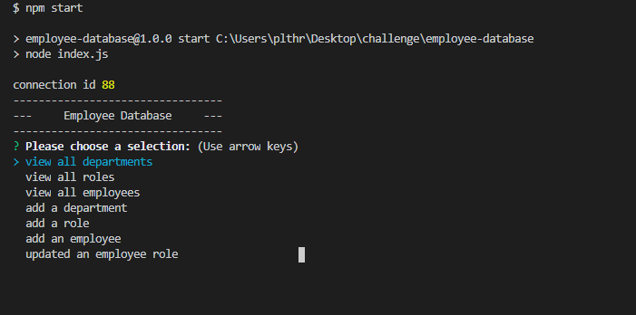

  # Employee Database

  

  ## Description 

  This is a database that will allow management to view and manage roles, departments and employees of the Company. 
  
  
  ## Table of Contents
    
  * [Installation](#installation)
  * [Usage](#usage)
  * [License](#license)
  * [Questions](#questions)
  
  
  ## Installation
  
  Since this is a program that is run in the command line, the following items will need to be installed on your computer to access the information: 
  * Node.js: Link to install https://nodejs.org/en/ 
  * The console.table package: Link on how to install https://www.npmjs.com/package/console.table 
  * The inquirer package: Link on how to install https://www.npmjs.com/package/inquirer#installation 
  * MySQL2 package: Link on how to install https://www.npmjs.com/package/mysql2#installation 
  
  
  ## Usage 
  
  * You can start the program by typing "npm start" into the command line. You will then be given a list of actions to choose from. Some actions only allow you to view the data while others allow you to add or update some data. Each option you can select gives you the information you will need to fill out the appropriate response. 
  
   

  * Link to video walk through https://drive.google.com/file/d/1XNm7HdNf8_96jj1UtOPxQhWw_3R4OJ8G/view
  
  
  ## License
  
  MIT

  ## Questions
  For questions you can contact me here:
  * GitHub Username: https://github.com/siwel20/
  * email: plthrock@gmail.com
